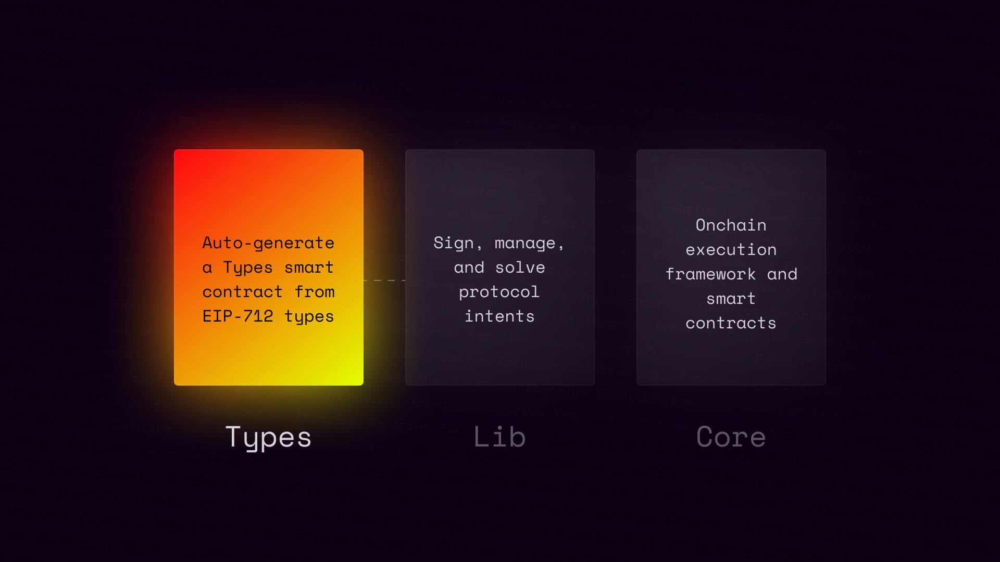

# @nftchance/emporium-types



<!-- TODO: Why? -->

## Getting Started

`emporium-types` has been designed to be as hands-off as possible. 

With reasonable defaults pre-loaded you can choose to work with the default values or extend them to fit your needs in the case that you are building a more complex protocol.

### Installation

To install dependencies required to power `emporium-types`:

```bash
bun install
```

## Basic Usage

To generate the `Solidity` from your `EIP-712` types run:

```bash
bun emporium generate
    -o --output <filename> "Output path of generated Solidity."
```

By default the contract will be exported to `./dist/contracts/Types.sol` where you can take it from and do whatever you like.